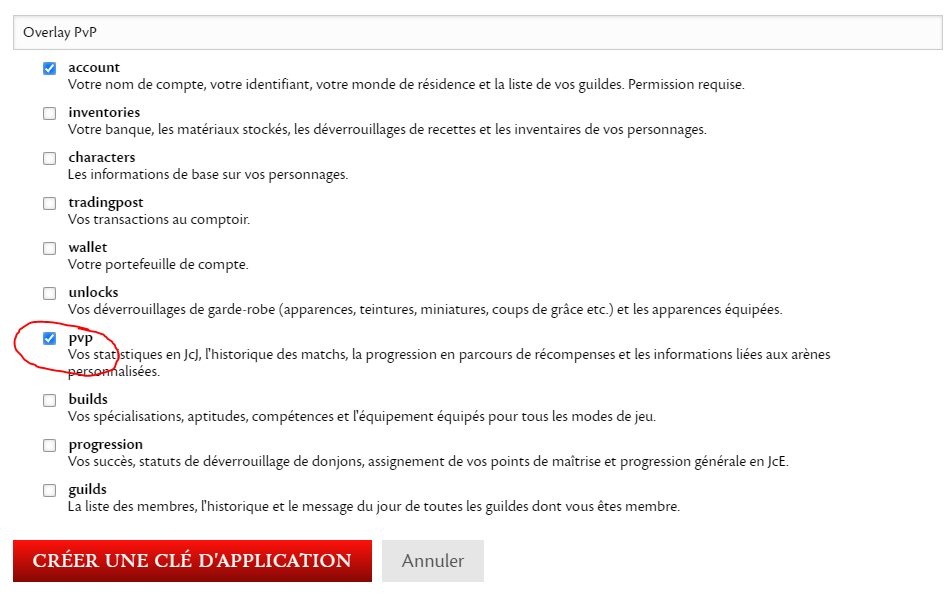
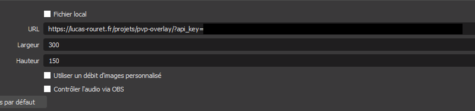
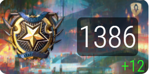

# Overlay PvP Ranked Guild War 2


## Comment l'installer

Il n'y a rien à installer ! Il suffit de compléter cet URL :

```
https://lucas-rouret.fr/projets/pvp-overlay/?api_key=VOTRE_API_KEY_AVEC_LES_DROITS_PVP
```

Il faut remplacer "VOTRE_API_KEY_AVEC_LES_DROITS_PVP" par votre une clé API d'Arena avec les droits en pvp :




Il vous suffit maintenant de créer une source "Navigateur" dans OBS (ou autre logiciel).
La taille de l'overlay est **300x150** :



Et voilà !!! Votre beau overlay !



